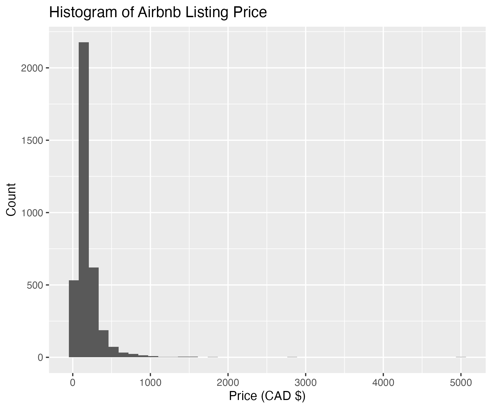
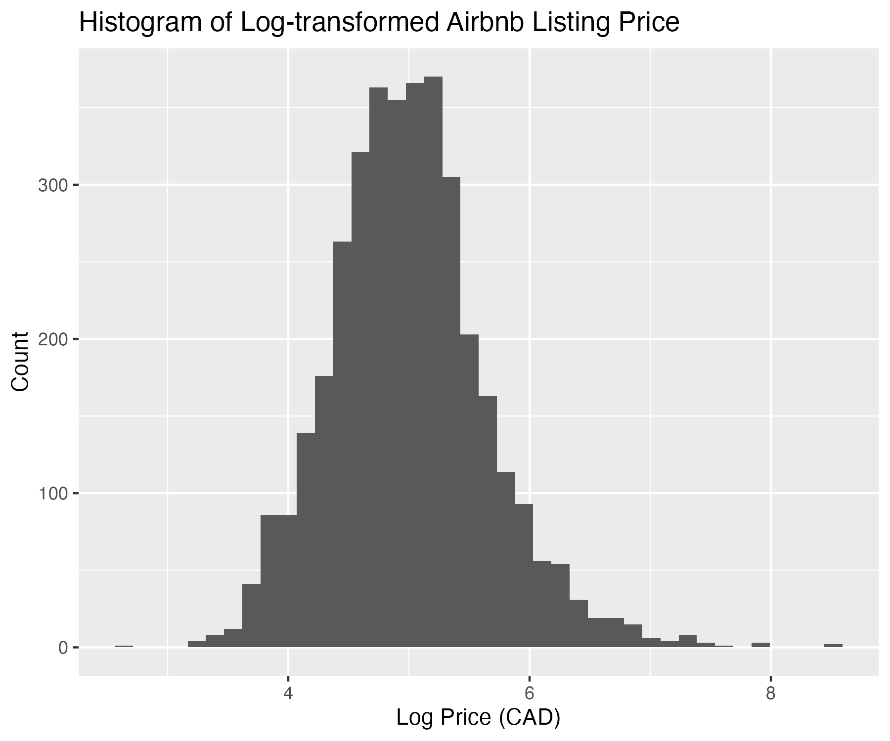
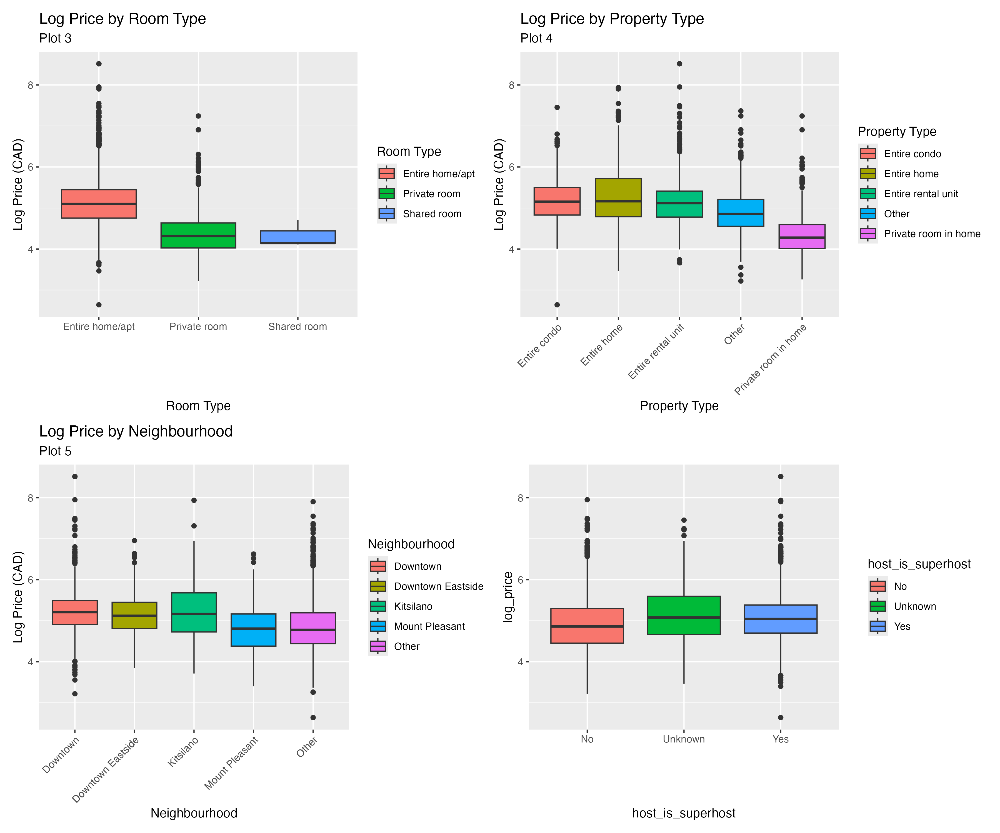
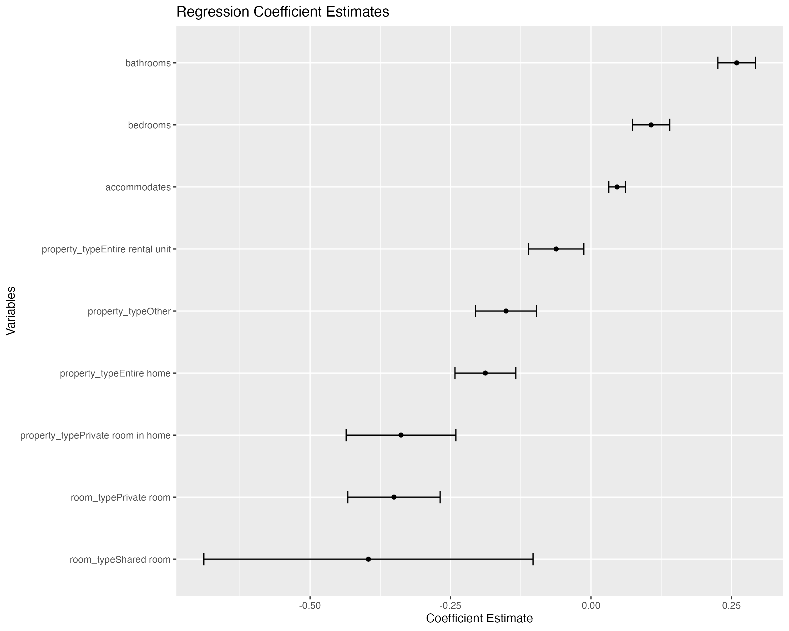
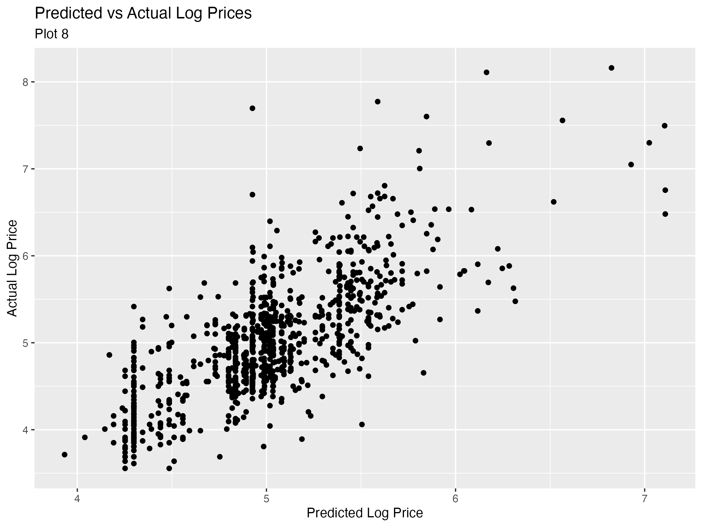

```{r}
#| label: load-artifacts
#| include: false

library(tidyverse)
library(readr)
library(dplyr)
library(knitr)

# Load raw dataset
raw_airbnb <- read_csv("../data/raw/listings.csv")

# Load processed datasets generated by pipeline scripts
cleaned_airbnb <- read_csv("../data/processed/cleaned_airbnb.csv")
airbnb_train <- read_csv("../data/processed/train_airbnb.csv")
airbnb_test <- read_csv("../data/processed/test_airbnb.csv")

# Load analysis artifacts generated by pipeline scripts
corr_tbl <- read_csv("../results/correlation_table.csv")
vif_tbl <- read_csv("../results/vif_table.csv")
metrics_tbl <- read_csv("../results/model_metrics.csv")
airbnb_model <- readRDS("../results/airbnb_model.rds")

# Ensure log_price is available for inline stats and diagnostics
if (!"log_price" %in% names(airbnb_train)) {
  airbnb_train <- airbnb_train %>% mutate(log_price = log(price))
}
if (!"log_price" %in% names(airbnb_test)) {
  airbnb_test <- airbnb_test %>% mutate(log_price = log(price))
}

# Metrics from results folder
rmse <- metrics_tbl %>% filter(Metric == "RMSE") %>% pull(Value) %>% .[1]
r2_test <- metrics_tbl %>% filter(Metric == "R_squared") %>% pull(Value) %>% .[1]

# Predictions for narrative/derived summaries
predictions <- predict(airbnb_model, newdata = airbnb_test)
actuals <- airbnb_test$log_price
```

## Summary

A total of `r nrow(raw_airbnb)` Airbnb listings throughout Vancouver, Canada were analysed to determine which of their respective features were most strongly associated with rental pricing. The report utilises Exploratory Data Analysis (EDA) and a multiple linear regression model on a log scale to take outliers into account.

## Introduction

Airbnb is a company that acts as a middleman between homeowners and tourists through providing the former a platform to use their property as vacation rentals.

The dataset used for this research project was detailed Airbnb listings data in Vancouver. This dataset held many features that detailed each listing in the city concerning the host (e.g., response rate, superhost status), the property (e.g., room type, neighbourhood, number of bedrooms), and pricing. There are in total `r ncol(raw_airbnb)` features throughout this dataset and `r nrow(raw_airbnb)` rows.

Many of these features are associated with the listing prices, however only some are expected to have strong links to them. After identifying and selecting features with the most association, can they be used to predict the nightly price of any Airbnb listing in Vancouver?

**Research Question:**
**Can we predict the nightly price of Airbnb listings in Vancouver, British Columbia using key hosting and property features?**

## Methods and Results

### Data Cleaning and Processing

The raw dataset contained `r ncol(raw_airbnb)` features. During data cleaning and preprocessing, we selected the most relevant features for modeling and handled missing values appropriately. The raw listings had `r nrow(raw_airbnb)` entries, which were reduced to `r nrow(airbnb_train) + nrow(airbnb_test)` after removing rows with missing values in key predictors. 

Since the number of unique property types and neighbourhoods is large, including all categories may reduce model stability and interpretability. Therefore, we merge less frequent property types and neighbourhoods into a single category labelled “Other”. This allows us to retain the most common categories while reducing noise from rare categories.

### Train-Test Split

The dataset was split into `r nrow(airbnb_train)` training samples and `r nrow(airbnb_test)` test samples. This corresponds to approximately `r round(100 * nrow(airbnb_train) / (nrow(airbnb_train) + nrow(airbnb_test)), 1)`% training and `r round(100 * nrow(airbnb_test) / (nrow(airbnb_train) + nrow(airbnb_test)), 1)`% testing. The split is necessary to prevent data leakage in model development.

### Exploratory Data Analysis

{#fig-price-distribution width=70%}

The histogram in @fig-price-distribution shows that the distribution of `price` is extremely right-skewed with many outliers at high prices. We apply a log transformation and use **log-transformed price** `log_price` in the regression analysis to improve normality and stabilize variance [@draper1998applied]. This is shown in the @fig-log-price-distribution histogram, where the distribution of `log_price` is more symmetric and less skewed compared to the original `price`.

{#fig-log-price-distribution width=70%}

We conduct exploratory data analysis (EDA) to identify variables most strongly associated with `log_price`. These variables are then selected as predictors in the multiple linear regression model.

#### Analyzing Numeric Variables

```{r}
#| label: tbl-correlation
#| tbl-cap: "Correlation between log price and numeric predictors"

corr_tbl %>%
  mutate(correlation = round(correlation, 3)) %>%
  knitr::kable(align = c("l", "r"))
```

@tbl-correlation shows the Pearson correlation coefficients between `log_price` and numeric predictors. Variables such as `accommodates`, `bedrooms`, and `bathrooms` show **moderately strong correlations** because their coefficients are larger than 0.5. Variables such as `review_scores_rating` and `reviews_per_month` show weaker linear relationships.

#### Analyzing Categorical Variables

{#fig-boxplots width=95%}

@fig-boxplots illustrates the relationship between `log_price` and four categorical variables. Plot (a) shows clear difference in log price range and median log prices across different room types, with entire homes having higher prices than private or shared rooms. Plot (b) also shows clear differences in median log prices across different property types. In contrast, Plot (c) and Plot (d) show more overlap among groups. Therefore, `room_type` and `property_type` **appear to be stronger predictors of** `log_price` and are more suitable to be included in the regression model.

### Multicollinearity Check

Based on the exploratory data analysis, we initially selected five variables (`bathrooms`, `accommodates`, `bedrooms`, `room_type`, and `property_type`) as potential predictors of `log_price`. Before finalizing the model, we need to conduct a **Variance Inflation Factor (VIF) analysis to check multicollinearity**, which refers to the situation where predictor variables are highly correlated with one another, inflate standard errors and reduce model stability [@belsley1980regression].

```{r}
#| label: tbl-vif
#| tbl-cap: "Variance Inflation Factor (VIF) for selected predictors"

vif_tbl %>%
  mutate(VIF = round(VIF, 3)) %>%
  knitr::kable(align = c("l", "r"))
```

@tbl-vif shows that all variables have VIF values below 5, indicating low levels of multicollinearity. Therefore, we include all five variables in the final multiple linear regression model.

### Multiple Linear Regression Model

After building, the estimated multiple linear regression model is specified as:

$$\log(\text{Price}) = \beta_0 + \beta_1 \cdot \text{accommodates} + \beta_2 \cdot \text{bedrooms} + \beta_3 \cdot \text{bathrooms} + \sum \beta_i \cdot \text{room\_type}_i + \sum \beta_j \cdot \text{property\_type}_j$$

Where:
- $\beta_0$ (intercept) = `r round(coef(airbnb_model)["(Intercept)"], 5)`
- $\beta_1$ (accommodates) = `r round(coef(airbnb_model)["accommodates"], 5)`
- $\beta_2$ (bedrooms) = `r round(coef(airbnb_model)["bedrooms"], 5)`
- $\beta_3$ (bathrooms) = `r round(coef(airbnb_model)["bathrooms"], 5)`

### Model Predictions and Performance

The model was evaluated on the test set and achieved an RMSE of `r round(rmse, 3)` and an R-squared of `r round(r2_test, 3)`. This means the model explains approximately `r round(r2_test * 100, 1)`% of the variance in log-transformed nightly prices on unseen data.

## Discussion

### Model Interpretation and Evaluation

{#fig-coefficients width=85%}

Some interpretation of the input variables are that all numeric inputs hold a positive relationship with price. `bathrooms` has the most impactful feature with a coefficient of `r round(coef(airbnb_model)["bathrooms"], 5)`. The other numerical features `bedrooms` (coefficient: `r round(coef(airbnb_model)["bedrooms"], 5)`) and `accommodates` (coefficient: `r round(coef(airbnb_model)["accommodates"], 5)`) also drive price upwards. 

`room_type` and `property_type` being negative coefficients indicate that these features decrease price relative to their baseline categories (`Entire home/apt` and `Entire condo`). Listing a `Private room` (`r round(coef(airbnb_model)["room_typePrivate room"], 5)`) or `Shared room` (`r round(coef(airbnb_model)["room_typeShared room"], 5)`) can drastically reduce the expected price compared to the entire apartment. Similarly in the case of the `entire condo` baseline, `Entire rental unit` (`r round(coef(airbnb_model)["property_typeEntire rental unit"], 5)`) and `Entire home` (`r round(coef(airbnb_model)["property_typeEntire home"], 5)`) have smaller but still negative price differences compared to the baseline.

Based on the adjusted R-squared value, the model yielded an adjusted R-squared of `r round(summary(airbnb_model)$adj.r.squared, 3)`, meaning that the selected five predictors explain `r round(summary(airbnb_model)$adj.r.squared * 100, 1)`% of the variance in log-transformed prices. The model F-statistic (`r round(summary(airbnb_model)$fstatistic[1], 2)`, p `r format.pval(pf(summary(airbnb_model)$fstatistic[1], summary(airbnb_model)$fstatistic[2], summary(airbnb_model)$fstatistic[3], lower.tail = FALSE), digits = 3, eps = 2.2e-16)`) indicates that the overall model is highly significant. Every predictor was statistically significant; the largest coefficient p-values were for `room_typeShared room` and `property_typeEntire rental unit` (`r signif(max(summary(airbnb_model)$coefficients[-1, 4]), 3)`), which are still below the 0.05 threshold.

@fig-coefficients visualizes that `bathrooms` sitting at the far right is clearly the most powerful positive driver with a very tight confidence interval. Meanwhile, the room types and private room predictors sit further left, visually confirming how lack of privacy is a negative factor on a listing's price. The extremely wide confidence interval for the predictor `room_typeShared room` can likely be due to a smaller sample size of this category in the selected sample from the dataset. 

### Test Set Performance

{#fig-pred-actual width=80%}

From @fig-pred-actual, in the lower log price range (4-6), the majority of points are clustered along the diagonal, indicating that the model predicts reasonably well in this range, albeit with noticeable scatter suggesting limited precision.

In the upper log price range (6+), points deviate further from the diagonal, indicating weaker predictive performance. This is likely due to fewer observations at higher price points, which limits the model's ability to learn patterns in this range.

The model was evaluated on the test set and achieved an RMSE of `r round(rmse, 3)` and an R-squared of `r round(r2_test, 3)`. This means the model explains approximately `r round(r2_test * 100, 1)`% of the variance in log-transformed nightly prices on unseen data. The RMSE of `r round(rmse, 3)` on the log scale indicates that, on average, predictions deviate from the actual log price by `r round(rmse, 3)` units, which corresponds to a multiplicative error of about e<sup>`r round(rmse, 3)`</sup> = `r round(exp(rmse), 2)`x in price terms.

Overall the model demonstrates moderate predictive performance. It captures nearly half the variability in Airbnb nightly prices using only five features (accommodates, bedrooms, bathrooms, room type, and property type), suggesting these features are meaningful predictors but that other unincluded features likely explain the remaining variance [@lee2019airbnb; @weissfeld2005modelling].

### Summary

The multiple linear regression model achieved a test RMSE of `r round(rmse, 3)` and a test R-squared of `r round(r2_test, 3)`, meaning the model explains approximately `r round(r2_test * 100, 1)`% of the variance in log-transformed nightly prices on unseen data. Physical capacity features were the strongest predictors, with `accommodates` (r=`r round(cor(airbnb_test$accommodates, airbnb_test$log_price, use = "complete.obs"), 2)`), `bedrooms` (r=`r round(cor(airbnb_test$bedrooms, airbnb_test$log_price, use = "complete.obs"), 2)`), and `bathrooms` (r=`r round(cor(airbnb_test$bathrooms, airbnb_test$log_price, use = "complete.obs"), 2)`) contributing the most to the model's predictive power. Categorical features like `room_type` and `property_type` also improved predictions by capturing privacy and property differences between listings. In contrast, host-centered features such as `review_scores_rating` (r=`r round(cor(airbnb_test$review_scores_rating, airbnb_test$log_price, use = "complete.obs"), 2)`) and superhost status showed weak predictive value and were excluded from the final model. Overall, the model demonstrates moderate predictive performance using only five features, suggesting that while physical property characteristics are useful predictors of nightly price, other unincluded features such as amenities or location proximity likely explain the remaining variance.

### Key Takeaways

A key takeaway is for tourists looking for accommodation in the city. Naturally, the premium sounding name of "superhost" would get people to believe that properties owned by them would be more expensive to stay in. However with these results, budget-conscious tourists can conduct better research into their accommodations by placing less consideration on host status and more on listing characteristics such as room type and bathroom count.

Additionally, the model's test R-squared of `r round(r2_test, 3)` suggests that nearly half of the variance in nightly prices can be predicted using just five easily observable features: room type, property type, number of bathrooms, bedrooms, and capacity. This means tourists can get a reasonable estimate of whether a listing is fairly priced simply by looking at these features, without needing to dig into host history or review scores.

### Limitations and Future Work

Future analysis could explore additional features not included in this model, such as listing amenities, proximity to landmarks, or seasonal pricing trends, to improve predictive performance [@lee2019airbnb]. Additionally, more complex models such as random forests or gradient boosting could be tested to determine whether they yield better predictions than the linear regression model used here. Cross-validation could also be applied to get a more robust estimate of the model's predictive performance [@weissfeld2005modelling].

## References
